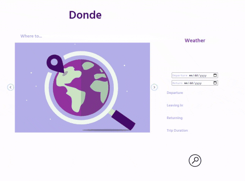

# Donde - Travel App
## Udacity Capstone Project

The app is for a user to search for any location and see weather information and images of the location. 

## Building & Runnin the app

### &nbsp;&nbsp;&nbsp;&nbsp; *npm start*
Starts the server on port 5000 as specified on .env file

### &nbsp;&nbsp;&nbsp;&nbsp; *npm run build-dev*
Builds the development dist folder - no minimization

### &nbsp;&nbsp;&nbsp;&nbsp; *npm run build-prod*
Builds the production dist folder

### &nbsp;&nbsp;&nbsp;&nbsp; *npm run launch*
Builds the production dist folder and starts the server on port 5000

### &nbsp;&nbsp;&nbsp;&nbsp; *npm test*
Run Jest test


```json
  "scripts": {
    "start": "nodemon src/server/server.js",
    "test": "jest",
    "build-dev": "webpack  --config ./webpack.dev.js",
    "build-dev-server": "webpack-dev-server  --config ./webpack.dev.js --open",
    "build-prod": "webpack  --config ./webpack.prod.js",
    "launch": "webpack --config ./webpack.prod.js && node src/server/server.js"
  }
```  

---
---
## User Experience
To get started, click on the search window and start typing.

You may search for city, state, or country. 



As of right now, the app displays the images - with author and tag info -, weather, and it allows you to pick trip dates.

Further functionality could include Hotel and nearby search to be launched by the magnified glass search button. 


---
---
## APIs Workflow

The autocomplete search box is powered by Google [Place Autocomplete](https://developers.google.com/maps/documentation/places/web-service/autocomplete?hl=id) API.

The autocompleted location values are used to make serveral calls:

* Images: [Pixabay API](https://pixabay.com/api/docs/)

* Weather: [Weatherbit API](https://www.weatherbit.io/api)


* Country Information: [GeoNames API](http://www.geonames.org/export/web-services.html)

    This API is called when the user input **is not** in the form of city, state, contry, for example, they sarch for "Spain".
    
    We call it with the country code and find cities within the country.
    
    These cities are then used, along with the country, to query Pixabay.


---
---

## Javascript 
   ### Server Side

### **Module:** _geonames.js_
Takes the places autocomplete output, calls the GeoNames API if needed.

Returns the URLS for the Pixabay call.


```javascript
// Geoname Call if Needed
        geoURL = `http://api.geonames.org/searchJSON?
        country=${req.body.code}&maxRows=10&&username=${username}`;

        const geoResponse = await axios.get(geoURL)
```
The module also finds cities from the GeoName response and remoe empty spaces.

```javascript
// processResults()

    for (const location of geoNamesResponse){

        if (location.fclName == 'city, village,...' 
        && locationfcodeName == 'capital of a political entity'){
            cities.capital = location.name.split(' ').join('%20');
            continue;
        }

      return  cities
```
The module returns a Pixabay url Array 

```javascript
return [`https://pixabay.com/api/?key=${process.env.PIXABAY_KEY}&q=${req.body.city}+${req.body.state}&image_type=photo`, ...]}

```


### **Module:** _imagesObject.js_

Inserts the Pixabay response into an array with image URL and properties.
```javascript
// createImagesObject()
for (const image of fullResponse) {
  
          imageObject = {pictureURL: image.webformatURL, author: image.user, tags:image.tags}
}
```
### **Module:** _weatherObject.js_

Creates object with weather API results to pass to client-side.
```javascript
    weatherResults = {
      description: weather['data'][0].weather.description,
      temp: weather['data'][0].temp,
      wind: weather['data'][0].wind_spd,
      iconUrl: `https://www.weatherbit.io/static/img/icons/${weather['data'][0].weather.icon}.png`
    }
```
   ### Client Side

### **Module:** _autocomplete.js_

Sets the search values as input properties and starts the API calling process
```javascript
    const searchInput = document.getElementById('search-box');
    searchInput.setAttribute('data-lng', place.geometry.location.lng());
            
    searchInput.setAttribute('data-lat', place.geometry.location.lat());
    setPros(place.address_components);
    callMainApis()
```

### **Module:** _callAPIs.js_
POST calls to server side and renders results.
```javascript
function callMainApis(){
    passCoordinates();
    callPixabay()
}

passCoordinates()
    fetch('http://localhost:5000/weather', {
        method: 'POST',
    
callPixabay()
    fetch('http://localhost:5000/pixabay', {
        method: 'POST',
        renderImages(data)

function renderImages(){
  InnitialCarouselSetUp();
}
```
### **Module:** _carousel.js_
Sets up and renders the images carousel.

Images are loaded via lazy load.
```javascript
const track = document.querySelector('.carousel__track');
const currentSlide = track.querySelector('.current-slide');
        
lazyLoadImage(currentSlide);
setAuthorTags(currentSlide);

function lazyLoadImage(currentSlide){
    currentSlide.firstChild.src = currentSlide.firstChild.dataset.src;
}
```

## What's Next?
### Future features and improvements
Right now the search features are launched directly from the autocomplete search box. 
The magnified glass serach icon does nothing.

We would like to add some features and fine-tune some aspects of the app.

### &nbsp;&nbsp;&nbsp;&nbsp; *Hotels Search*
We would like to add additional APIs to provide access to hotels and other lodging resources.

### &nbsp;&nbsp;&nbsp;&nbsp; *Nearby Search*
Using the GeoNames API, we would like to display cities & countries in the region the user searched for.

### &nbsp;&nbsp;&nbsp;&nbsp; *Order GeoNames and Pixabay Outputs*
We want to implement server-side fetures:
* return Pixabay images organized by popularity & relevance.
* return cities from GeoNames organized by population and relevance.
* implement historical weather data for range of dates so users can plan trips better.

&nbsp;&nbsp;&nbsp;&nbsp; Note: Historical data for a range of dates is a paid service.

